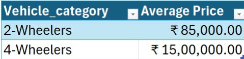
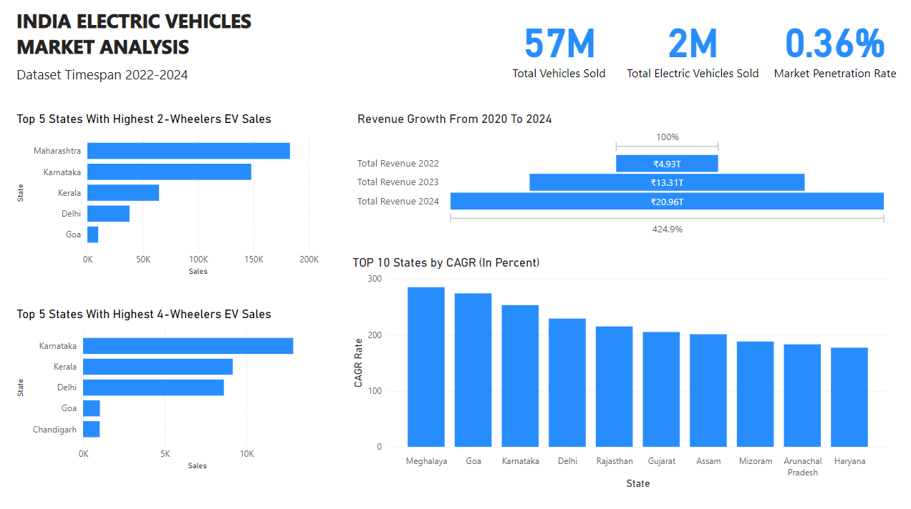
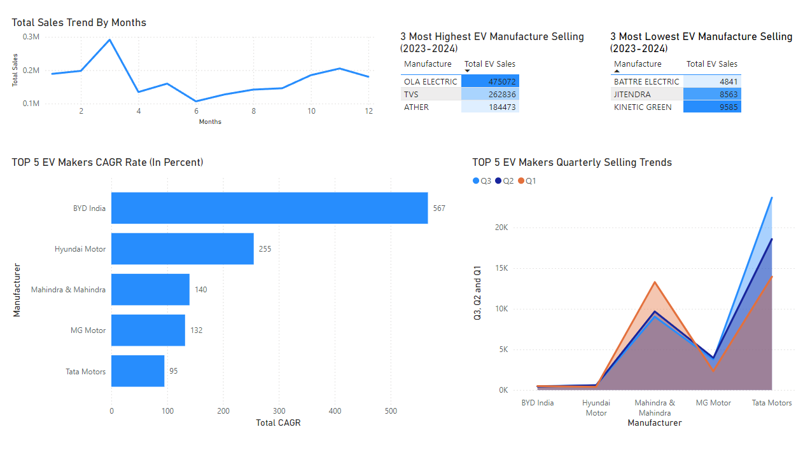

# Introduction
  This Project originaly From CodeBasic 12Th week challenge on analysing EV Market in India, with a minor adjusment for learning purpose.

🔍 Shortcut To Project Queries : **[project_files](/Query/)**

### Problem Statement

AtliQ Motors is an automotive giant from the USA specializing in electric vehicles(EV). In the last 5 years, their market share rose to 25% in electric and hybrid vehicles segment in North America. As a part of their expansion plans, they wanted to launch their bestselling models in India where their market share is less than 2%. 
Bruce Haryali, the chief of AtliQ Motors India wanted to do a detailed market study of existing EV/Hybrid market in India before proceeding further. Bruce gave this task to the data analytics team of AtliQ motors and Peter Pandey is the data analyst working in this team.

### The Question To Answer
  1. List the top 3 and bottom 3 makers for the fiscal years 2023 and 2024 in terms of the number of 2-wheelers sold.
  2. Identify the top 5 states with the highest penetration rate in 2-wheeler and 4-wheeler EV sales in FY 2024.
  3. List the states with negative penetration (decline) in EV sales from 2022 to 2024?
  4. What are the quarterly trends based on sales volume for the top 5 EV makers (4-wheelers) from 2022 to 2024?
  5. How do the EV sales and penetration rates in Delhi compare to Karnataka for 2024?
  6. List down the compounded annual growth rate (CAGR) in 4-wheeler  units for the top 5 makers from 2022 to 2024.
  7. List down the top 10 states that had the highest compounded annual growth rate (CAGR) from 2022 to 2024 in total vehicles sold.
  8. What are the peak and low season months for EV sales based on the
  data from 2022 to 2024? 
  9. What is the projected number of EV sales (including 2-wheelers and 4-  wheelers) for the top 10 states by penetration rate in 2030, based on the compounded annual growth rate (CAGR) from previous years?
  10. Estimate the revenue growth rate of 4-wheeler and 2-wheelers EVs in India for 2022 vs 2024 and 2023 vs 2024, assuming an average unit price. 
  

# Tools
-   **PostgreSQL**: Acts as the database management system for storing,    managing, and querying EV market data. Supports complex SQL queries, aggregations, and data transformations for metrics like penetration rates and CAGR.
  - **Power BI**: Provides visualization and reporting tools to create interactive dashboards and reports. Connects to PostgreSQL for data import, enabling the creation of charts, graphs, and maps to represent trends and insights.
  - **SQL**: Serves as the main language for querying and manipulating data within PostgreSQL. Executes data retrieval, manipulation, and aggregation tasks.
  - **Git and GitHub**: Manage version control and collaboration for project files and code. Git tracks changes to SQL scripts and Power BI reports; GitHub hosts the repository for collaboration, version tracking, and backup.

# The Analysis
 
 
 
 - Based on the data presented, the market penetration of electric vehicles (EVs) in India is 0.36% of the total vehicle sales, with approximately 2 million EVs sold out of a total of 57 million vehicles.

- The top 5 regions for 2-wheeler EV sales are led by Maharashtra in first place, followed by Karnataka, Kerala, Delhi, and Goa.

- For 4-wheeler EV sales, Karnataka ranks first, followed by Kerala, Delhi, Goa, and Chandigarh.

- The regions with the highest Compound Annual Growth Rate (CAGR) in EV sales are as follows:

  1. Meghalaya
  2. Goa
  3. Karnataka
  4. Delhi
  5. Rajasthan
  6. Gujarat
  7. Assam
  8. Mizoram
  9. Arunachal Pradesh
  10. Haryana

- Regarding sales volume by month, the highest sales consistently occur in March over the past three years, while the lowest sales are recorded in June.

- The top three manufacturers in terms of sales for the period 2023-2024 are:
  1. BattRE Electric
  2. Jitendra
  3. Kinetic Green
- Conversely, the three manufacturers with the lowest sales in the same period are:
  1. Ola Electric
  2. TVS
  3. Ather
- Finally, the top 5 companies in 4-wheeler electric vehicle sales for the period 2022-2024 are:

  1. BYD India
  2. Hyundai Motor
  3. Mahindra & Mahindra
  4. MG Motor
  5. Tata Motors
  
# What I Learned
- **Data Analysis Techniques**: Strengthened my ability to perform detailed SQL queries to extract meaningful insights, including calculating penetration rates and CAGR, and understanding complex market trends over time.
- **Visualization Mastery**: Improved skills in designing effective visualizations with Power BI, allowing for clear communication of data trends and findings, particularly in the context of a growing market like EVs.
- **Version Control Proficiency**: Enhanced my experience with Git and GitHub for version control, which is critical for tracking changes, collaborating with others, and maintaining a history of project development.
# Conclusion
The analysis provided a detailed view of the EV market in India, revealing significant trends in regional penetration rates, sales volumes, and growth dynamics. These insights are crucial for companies like AtliQ Motors as they consider expanding in a rapidly developing market.
### Key takeaways include:
- Maharashtra leads in 2-wheeler EV sales, while Karnataka is the frontrunner in 4-wheeler sales.
- Meghalaya's highest CAGR reflects its fast-growing potential in the EV market.
- March consistently emerges as the peak sales month for EVs, with June recording the lowest sales.
- BattRE Electric, Jitendra, and Kinetic Green are the top performers in 2023-2024, while BYD India leads in 4-wheelers.
### Final Thoughts:
This project served as a crucial learning experience, demonstrating the importance of data-driven decisions in the evolving EV market in India. The insights gained are invaluable for informing strategic plans, particularly in a market poised for significant growth.
